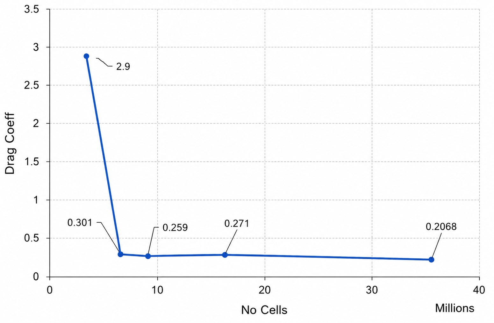
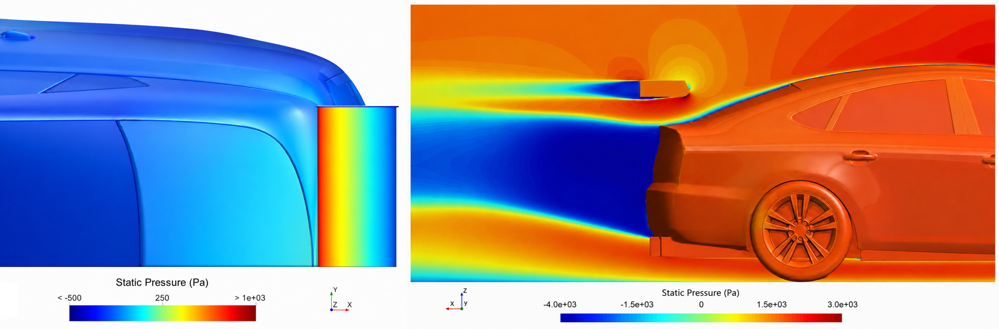
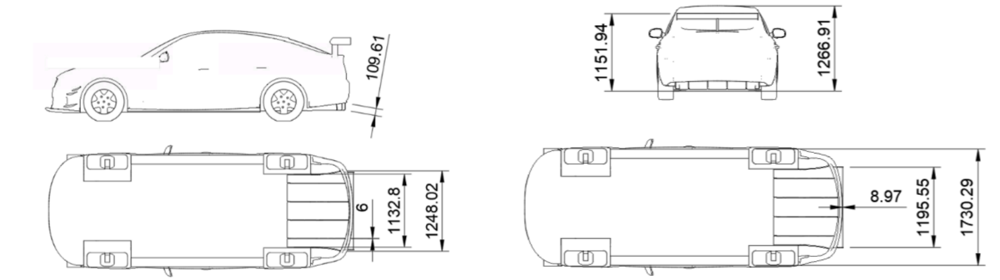
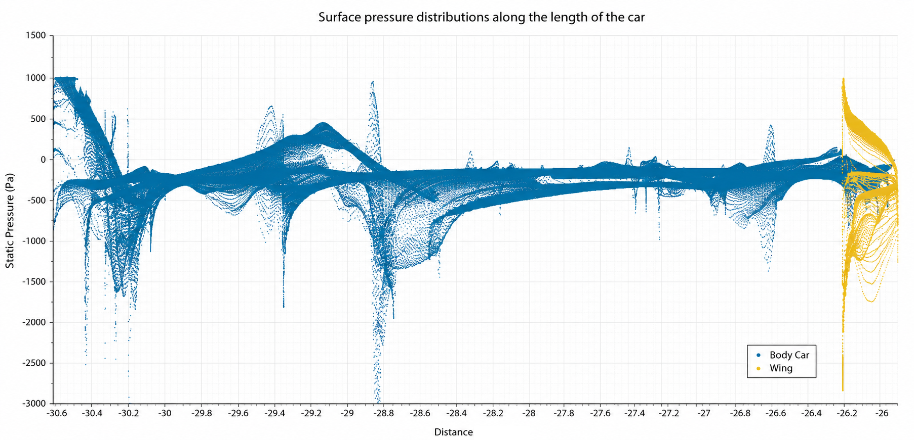
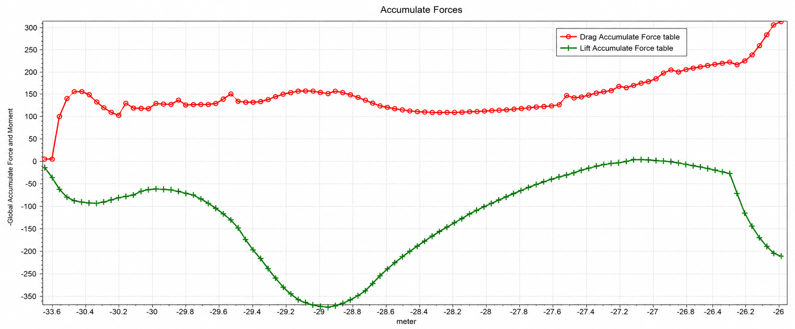

# GT3 DrivAer Fastback — Aerodynamic Optimisation Using CFD

[](LICENSE)


*Baseline DrivAer Fastback — velocity magnitude and static pressure distribution at 40 m/s.*

---

## Project Overview

This project details the **CFD-driven aerodynamic development and validation of a GT3 package** for the 1:2.5 DrivAer Fastback, targeting the LMGT3 race series regulations. Using STAR-CCM+ with a steady-state RANS approach, the team conducted a structured optimisation campaign focused on maximising the **lift-to-drag ratio (Cl/Cd)** while generating sufficient rear downforce for vehicle stability.

The work was divided across three engineering areas — **front bodywork**, **floor and diffuser**, and **rear wing** — iterated through three aerodynamic configurations, and converged on a final design that achieved a **20% improvement in Cl/Cd** over the baseline, in full compliance with GT3 regulations.

> **My primary responsibility was the rear aerodynamic development (rear wing design and angle of attack optimisation) and the integration of all three sub-systems into the final consolidated aero package.**

---

## Team & Roles

| Member | Area of Responsibility |
|---|---|
| Wolfgang Guio | **Rear wing aerodynamics · Mesh independence study · CFD simulation execution · Final aero package integration** |
| Team Member 2 | Front bodywork — forebody lateral strakes  · CFD simulation execution |
| Team Member 3 | Floor aerodynamics — splitter diffuser geometry and inclination  · CFD simulation execution |

---

## Key Results

| Configuration | Cd | Cl | Cl/Cd | Lift Force (N) | Drag Force (N) |
|---|---|---|---|---|---|
| Baseline DrivAer | 0.27 | +0.02 | +0.061 | +15.98 | 263.53 |
| 1st Configuration | 0.30 | −0.21 | −0.693 | −198.85 | 286.66 |
| **2nd Configuration (Final)** | **0.27** | **−0.24** | **−0.863** | **−227.35** | **314.84** |
| 3rd Configuration | 0.31 | −0.20 | −0.633 | −190.94 | 301.69 |

- ✅ **20% improvement in Cl/Cd** vs. baseline
- ✅ Rear wing generates **~200 N of downforce**
- ✅ Design complies with **GT3 / LMGT3 regulations** (Articles II-12.4 and II-12.5)
- ✅ Baseline validated against published experimental data with **< 2.35% deviation**

---

## Methodology

### Numerical Approach

Simulations were conducted in **STAR-CCM+** following best practice guidelines for automotive external aerodynamics (Lanfrit, 2005; Makowski & Kim, 2000). All cases used:

- **Solver:** Steady-state Reynolds-Averaged Navier-Stokes (RANS)
- **Turbulence model:** Realizable k-ε with Two-Layer All y+ Wall Treatment
- **Inlet velocity:** 40 m/s (144 km/h)
- **Domain:** Full-scale model with smooth underbody, stationary wheels, and mirrors

The **Two-Layer All y+ Wall Treatment** was selected for its robustness across a wide range of y+ values (y+ < 5 and 30 < y+ < 30), accommodating the complex DrivAer geometry without requiring a uniform near-wall mesh resolution.

**Simulation simplifications vs. real-world conditions:**

| Feature | Simulation | Real World |
|---|---|---|
| Underbody | Smooth | Complex with components |
| Wheels | Stationary, flat contact patch | Rotating |
| Cooling packs | Omitted | Present |
| Flow regime | Steady-state | Transient |

### Physics Model Stack

```
Physics Model
├── Cell Quality Remediation
├── Constant Density (Gas)
├── Gradients
├── K-epsilon Turbulence
│   └── Realizable K-epsilon Two-Layer
├── Reynolds-Averaged Navier-Stokes
│   └── Segregated Flow → Solution Interpolation (Steady)
├── Three Dimensional · Turbulent
└── Two-Layer All y+ Wall Treatment → Wall Distance
```

### Mesh Independence Study

Progressive refinement from 55 mm down to 20 mm base mesh size, with volume controls added for local resolution in the wake and boundary layer regions.


*Drag coefficient convergence vs. number of mesh cells (millions).*

| Mesh | Base Size (mm) | No. Cells | Cd |
|---|---|---|---|
| Coarse | 55 | ~4.4M | 2.9 |
| Medium-Coarse | 45 | ~6.3M | 0.301 |
| **Selected ✓** | **35** | **~9.1M** | **0.259** |
| Medium-Fine | 30 | ~15.5M | 0.271 |
| Fine | 20 | ~35.4M | 0.207 |

The **35 mm base mesh** (9.1M cells) was selected as the optimal balance between accuracy and computational cost. Wall y+ values remained within the valid range (y+ < 30) throughout.


*Polyhedral surface mesh with prism layers on the DrivAer body — left: prism layer mesh; right: polyhedral cell structure.*

---

## Baseline DrivAer Validation

Before any modifications, the baseline DrivAer Fastback was validated against two independent published datasets.

| Method | Cd | Cl |
|---|---|---|
| **Own Simulation** | **0.273** | **0.0166** |
| Heft et al. (2012) — Experimental | 0.275 | — |
| Zore et al. (2019) — Numerical | — | 0.017 |
| **Difference** | **0.73%** | **2.35%** |

The baseline showed **net positive rear lift (+15.98 N)** — unsuitable for a GT3 race car, which requires strong rear downforce for stability under cornering and braking. This defined the primary target for the aerodynamic development campaign.

---

## Aerodynamic Development

### Design Iteration 1 — Initial Aero Package

The first configuration introduced:
- **3 forebody lateral strakes** (front) to manage front lift
- **Basic floor splitter diffuser** at 0° (floor)
- **Rear wing: 5% camber, 4° angle of attack** (rear)

| Cd | Cl | Cl/Cd | Front Cl | Rear Cl | Drag (N) | Lift (N) |
|---|---|---|---|---|---|---|
| 0.2978 | −0.2065 | −0.693 | −9.90E-02 | −1.08E-01 | 286.66 | −198.85 |

The package successfully reversed rear lift into downforce. Pressure field analysis indicated that both the floor inclination and rear wing angle of attack had significant headroom for efficiency gains.

---

### Design Iteration 2 — Optimised Configuration (Final)

Two targeted changes were applied based on Iteration 1 results:

1. **Floor:** Curved diffuser splitters added; **floor inclination raised to 6°**
2. **Rear wing:** **Angle of attack increased to 12°** — informed by Rijns et al. (2024), which shows efficiency gains plateau beyond 12°


*2nd configuration — static pressure on rear wing surface (left) and velocity/pressure side-view contour (right).*

| Cd | Cl | Cl/Cd | Front Cl | Rear Cl | Drag (N) | Lift (N) |
|---|---|---|---|---|---|---|
| 0.2737 | −0.2362 | **−0.863** | −1.04E-01 | −1.32E-01 | 314.84 | −227.35 |

This configuration produced the **best overall Cl/Cd ratio** across all iterations. The rear wing at 12° AoA with 5% camber was the most aerodynamically efficient combination tested.

---

### Design Iteration 3 — Floor Maximisation Study

A third configuration explored the floor's limits:
- **Floor inclination maximised to 10°**
- **Rear wing angle reduced to 8°** to offset expected drag increase

| Cd | Cl | Cl/Cd | Front Cl | Rear Cl | Drag (N) | Lift (N) |
|---|---|---|---|---|---|---|
| 0.3134 | −0.1983 | −0.633 | −7.17E-02 | −1.27E-01 | 301.69 | −190.94 |

Drag increased **12.6% relative to Iteration 2**. The steeper floor dominated the drag budget and the reduced wing angle was insufficient to compensate. Both Cl and Cl/Cd worsened. This configuration was rejected.

---

## Final Aerodynamic Package

**The 2nd configuration was selected** as the final GT3 aero package:

| Component | Final Specification |
|---|---|
| Front | 3× forebody lateral strakes |
| Floor | Curved splitter diffuser — 6° inclination |
| Rear wing | 5% camber · **12° angle of attack** |
| Cl/Cd improvement | **+20% vs. baseline** |

### GT3 Regulation Compliance


*GT3 compliance drawings — rear diffuser (Article II-12.4, left) and rear wing placement (Article II-12.5.a, right). Dimensions in mm.*

| Component | Requirement | Status |
|---|---|---|
| Rear diffuser overhang | < 1520 mm | ✅ |
| Diffuser fin thickness | 6 mm (4 fins) | ✅ |
| Fin upper ends from reference plane | < 250 mm | ✅ |
| Wing positioned below roof highest point | Required | ✅ |
| Wing overhang | 8.97 mm | ✅ |
| Wing width | 70% of car total width | ✅ |
| Wing pillar width | > 30 mm | ✅ |
| Wing pillar height | 75–120 mm | ✅ |
| End plate thickness | 10 mm | ✅ |

### Surface Pressure Analysis


*Surface pressure distributions along the car length — body (blue) and rear wing (yellow). The wing's clear pressure separation is the primary downforce mechanism.*

The rear wing (yellow) creates a distinct **high-pressure zone on the upper surface and a low-pressure zone on the lower surface**, generating the target downforce. The pressure differential is concentrated entirely at the rear of the car, confirming the rear development strategy was effective.

### Accumulated Aerodynamic Forces


*Drag (red) and lift (green) accumulated along the car length. The rear wing contributes ~200 N of downforce.*

The force accumulation plot confirms that the **rear half of the car is the dominant source of negative lift** — the intended outcome of the development. The trade-off is a drag increment from the wing, which is the fundamental balance in GT3 aerodynamic design.

---

## Yaw Sensitivity Analysis

The final package was evaluated at **0°, 5°, and 10° yaw** to assess performance under real racing conditions (cornering, crosswinds).


*Static pressure distribution on the GT3 DrivAer body at 5° yaw (left) and 10° yaw (right).*

| Yaw Angle | Cd | Cl |
|---|---|---|
| 0° | 0.27 | −0.24 |
| 5° | 0.31 | −0.09 |
| 10° | 0.31 | +0.14 |

Key findings:
- **Drag increases** at yaw due to the greater effective frontal area presented to the flow
- **Downforce reduces sharply** beyond 5° as separation and reattachment patterns around the body change
- The **drag increment rate decreases at higher yaw angles** — a non-linear behaviour
- At **10° yaw the car transitions to net positive lift**, underscoring the need for balanced yaw performance in GT3 competition

---

## Experimental Validation Proposal

An experimental campaign was proposed using the **8×6 wind tunnel**, selected for its low turbulence intensity (< 0.1%) and closed test section suitable for the DrivAer model scale.

| Parameter | Configuration |
|---|---|
| Vehicle model | 1:4 scale DrivAer Fastback with aero package |
| Rear wing | 5% camber, 12° AoA — as per CAD |
| Underbody | 1:4 scale Splitter Diffuser 6° |
| Wheels | Stationary, flat contact patch |
| Wind tunnel | 8×6 closed test section — Cranfield University |
| Freestream velocity | 40 m/s |
| Turbulence intensity | < 0.1% |
| Yaw angles tested | 0°, ±5°, ±10° |
| Force measurement | 6-component load cells under each wheel |
| Pressure measurement | Surface pressure taps — rear wing top face |
| Force sampling rate | Min. 5 Hz |
| Pressure sampling rate | 4 kHz (or higher) |

---

## Simulation Files

> ⚠️ **Raw STAR-CCM+ `.sim` files are not hosted here** due to file size (several GB per run). The structure below reflects what was produced during the project.

```
simulation-files/
├── baseline/
│   └── DrivAer_Fastback_Baseline_35mm.sim            # Validated baseline — Cd 0.273
│
├── config_1/
│   └── DrivAer_GT3_Config1_Wing4deg_Floor0deg.sim    # 1st iteration — Cl/Cd −0.693
│
├── config_2_final/
│   └── DrivAer_GT3_Config2_Wing12deg_Floor6deg.sim   # Final package — Cl/Cd −0.863 ✅
│
├── config_3/
│   └── DrivAer_GT3_Config3_Wing8deg_Floor10deg.sim   # Floor max study — rejected
│
├── yaw_study/
│   ├── DrivAer_GT3_Final_Yaw0deg.sim
│   ├── DrivAer_GT3_Final_Yaw5deg.sim
│   └── DrivAer_GT3_Final_Yaw10deg.sim
│
└── cad/
    ├── DrivAer_Fastback_1-2.5_Smooth_Underbody.SLDPRT
    ├── GT3_RearWing_5camber_12deg.SLDPRT
    ├── GT3_SplitterDiffuser_6deg.SLDPRT
    └── GT3_FrontStrakes_x3.SLDPRT
```

---

## Technologies

| Tool | Purpose |
|---|---|
| **STAR-CCM+** (Siemens) | CFD solver — mesh generation, physics, simulation, post-processing |
| **SolidWorks** | CAD modelling of aerodynamic components and GT3 compliance drawings |
| **RANS k-ε (Realizable)** | Turbulence modelling for external vehicle aerodynamics |
| **Two-Layer All y+ Wall Treatment** | Near-wall modelling across varying mesh densities |

---

## References

- Heft, A. I., Indinger, T., & Adams, N. A. (2012). Introduction of a new realistic generic car model for aerodynamic investigations. *SAE Technical Papers.* https://doi.org/10.4271/2012-01-0168
- Lanfrit, M. (2005). *Best practice guidelines for handling Automotive External Aerodynamics with FLUENT.*
- Makowski, F. T., & Kim, S.-E. (2000). *Advances in External-Aero Simulation of Ground Vehicles Using the Steady RANS Equations.*
- Rijns, S., Teschner, T. R., Blackburn, K., & Brighton, J. (2024). Effects of cornering conditions on the aerodynamic characteristics of a high-performance vehicle and its rear wing. *Physics of Fluids, 36*(4). https://doi.org/10.1063/5.0204204
- Rijns, S., Teschner, T. R., Blackburn, K., Proenca, A. R., & Brighton, J. (2024). Experimental and numerical investigation of the aerodynamic characteristics of high-performance vehicle configurations under yaw conditions. *Physics of Fluids, 36*(4). https://doi.org/10.1063/5.0196979
- Salim, M., & Cheah, S.C. (2009). *Wall y+ strategy for dealing with wall-bounded turbulent flows.* International Association of Engineers.
- Schlatter, P., & Örlü, R. (2010). Assessment of direct numerical simulation data of turbulent boundary layers. *Journal of Fluid Mechanics, 659,* 116–126. https://doi.org/10.1017/S0022112010003113
- Zore, K., Caridi, D., & Lockley, I. (2019). Fast and Accurate Prediction of Vehicle Aerodynamics Using ANSYS Mosaic Mesh. *SAE Technical Papers, October.* https://doi.org/10.4271/2020-01-5011
- Cranfield University. (2024). *8×6 wind tunnel.* https://www.cranfield.ac.uk/facilities/8x6-wind-tunnel

---

## About

Completed as **Assessment 2 — CFD Coursework Report** for module **ENGR7006 Advanced Vehicle Aerodynamics**, Oxford Brookes University, Faculty of Technology, Design & Environment. Submitted December 2024.

---

## License

[MIT License](LICENSE) — DrivAer geometry based on the publicly available model by Heft et al. (2012) / TU Munich.
